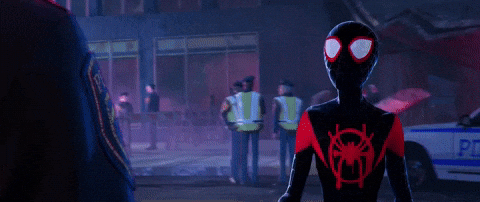

  

<!-- GitAnimals - Pet Screen -->

<!-- GitAnimals - Line Mode Pets -->

  
  
  

  

  
  
  
  
  
  
  
  
  
  
  

<!-- pacman -->
<picture>
    <source media="(prefers-color-scheme: dark)" srcset="https://raw.githubusercontent.com/lupienn/lupienn/output/pacman-contribution-graph-dark.svg">
    <source media="(prefers-color-scheme: light)" srcset="https://raw.githubusercontent.com/lupienn/lupienn/output/pacman-contribution-graph.svg">
    
</picture>

  

